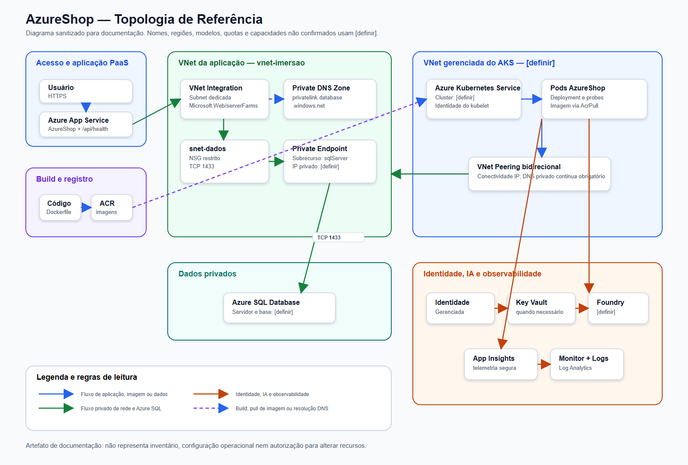
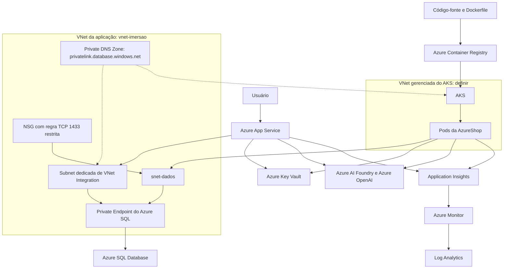
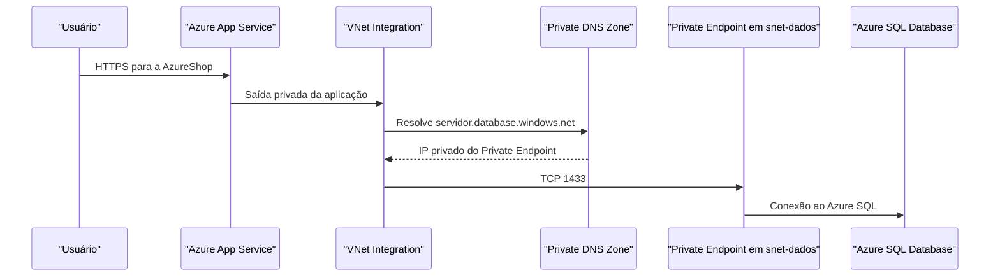
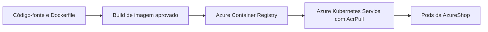
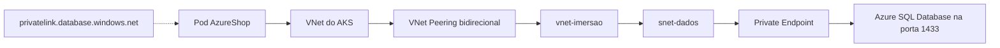
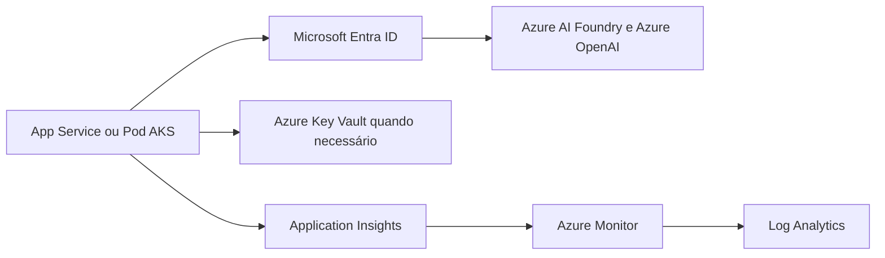

# Arquitetura AzureShop no Azure

## Objetivo e escopo

Este documento descreve a arquitetura de referência da **AzureShop**, uma aplicação Node.js com catálogo, carrinho, checkout e persistência em Azure SQL Database. O foco é mostrar fluxos de aplicação, dados, identidade, observabilidade e custo sem expor informações sensíveis.

**Princípios de documentação:**

- Não registrar segredos, chaves, tokens, connection strings, dados de clientes, IPs privados reais ou IDs sensíveis.
- Usar `[definir]` para modelo, deployment, região, quota, capacidade, nomes ou valores que não estejam confirmados.
- Manter a infraestrutura declarada em Terraform. Não gerar ou introduzir Bicep.
- Tratar o Azure Well-Architected Framework (WAF) como revisão de design, e não como auditoria, certificação ou garantia de conformidade.
- Submeter toda recomendação a revisão humana antes de alterar infraestrutura, código, permissões ou custos.

## Topologia de referência



> A imagem exportada complementa o Mermaid abaixo. A [fonte vetorial editável](architecture-assets/azure-shop-topology.svg) acompanha o PNG. Mantenha o Mermaid como fonte editável e atualize ambos após revisão humana de qualquer mudança arquitetural.



### Limites de rede, identidade e dados

| Limite | Responsabilidade |
|---|---|
| Internet para App Service | Recebe tráfego da aplicação PaaS pelo endpoint público aprovado. |
| `vnet-imersao` | Mantém a VNet da aplicação, a subnet de integração do App Service e `snet-dados`. |
| `snet-dados` | Hospeda exclusivamente o Private Endpoint do Azure SQL. |
| VNet gerenciada do AKS | Executa os nós e pods da AzureShop; o nome e os prefixos são `[definir]`. |
| VNet Peering | Fornece conectividade IP bidirecional entre VNet AKS e `vnet-imersao`; não substitui DNS privado. |
| Private DNS Zone | Faz `[servidor].database.windows.net` resolver para o IP privado do Private Endpoint nas duas VNets vinculadas. |
| Identidade | App Service e workloads AKS devem preferir identidade gerenciada, com menor privilégio, para acessar serviços Azure. |
| Dados e segredos | Azure SQL armazena o estado da aplicação; Key Vault guarda segredos apenas quando autenticação sem chave não for viável. |

## Fluxos de arquitetura

### 1. Aplicação PaaS para dados privados



O App Service usa o hostname normal do SQL. O Private Endpoint e a Private DNS Zone substituem o caminho público dentro da rede vinculada; o IP privado não deve ser colocado na configuração da aplicação.

### 2. Código para execução em AKS



O ACR armazena imagens com tags rastreáveis. O AKS deve obter imagens usando a função `AcrPull` atribuída à identidade adequada, sem habilitar credenciais administrativas apenas para contornar permissões.

### 3. Pods AKS para Azure SQL via rede privada



O NSG associado ao caminho de dados deve permitir somente os prefixos reais da VNet AKS para `snet-dados`, usando TCP 1433. Peering fornece roteamento IP; os links da Private DNS Zone a **ambas** as VNets fornecem a resolução privada.

### 4. Aplicação para IA, segredos e telemetria



O modelo, deployment, região, quota e capacidade do Azure AI Foundry/Azure OpenAI são `[definir]`. Endpoint e nome do deployment podem ser configurados como valores não secretos; a aplicação deve preferir autenticação Microsoft Entra ID. Se uma integração exigir chave, ela deve ser obtida pelo mecanismo aprovado no Key Vault, nunca por código, imagem, manifesto, log ou chat.

## Blueprint de componentes

| Componente | Responsabilidade | Dependências principais | Controle esperado |
|---|---|---|---|
| Azure App Service | Executar a AzureShop como PaaS | Plano compatível, configuração, VNet Integration, Azure SQL | Health check `/api/health`, identidade gerenciada, configuração sem segredo |
| `vnet-imersao` | Segmentar recursos da aplicação e dados | Subnets, NSG, Private DNS Zone, peering | Espaços sem sobreposição, menor privilégio |
| VNet Integration | Permitir saída privada do App Service | Subnet exclusiva delegada a `Microsoft.Web/serverFarms` | Não compartilhar com Private Endpoint |
| `snet-dados` | Isolar o Private Endpoint do SQL | NSG, Private Endpoint | Não hospedar VMs, AKS ou VNet Integration |
| Azure SQL Database | Persistir pedidos e catálogo | Private Endpoint, DNS, esquema `infra/sql/schema.sql` | TLS, acesso privado e credenciais protegidas |
| Private Endpoint | Expor o subrecurso `sqlServer` por IP privado | `snet-dados`, zone group, Private DNS Zone | Estado `Approved`, acesso público revisado |
| Private DNS Zone | Resolver o FQDN normal do SQL para IP privado | Links para `vnet-imersao` e VNet AKS | Registro automático desabilitado para esse cenário |
| VNet Peering | Conectar a VNet AKS e a VNet da aplicação | Duas direções, espaços sem sobreposição | Validar rota, DNS e tráfego permitido |
| NSG | Restringir tráfego para `snet-dados` | Prefixos reais da VNet AKS e VNet Integration | TCP 1433 somente da origem necessária |
| ACR | Armazenar imagens da AzureShop | Build, identidade do AKS | Tags rastreáveis e `AcrPull` |
| AKS | Executar pods e rollout da AzureShop | ACR, VNet, peering, DNS, Azure SQL | Probes, identidade, logs e capacidade revisada |
| Azure AI Foundry / Azure OpenAI | Inferência de IA quando aprovada | Modelo/deployment `[definir]`, identidade e quota | Limites, métricas, retry com backoff e revisão de custo |
| Azure Key Vault | Guardar segredos quando necessários | Identidade gerenciada e RBAC | Menor privilégio, rotação e sem exposição de valores |
| Azure Monitor, Application Insights e Log Analytics | Coletar telemetria e apoiar diagnóstico | Instrumentação aprovada | Sem prompts, respostas ou segredos sensíveis em logs |

## Decisões, trade-offs e riscos pelo WAF

| Pilar WAF | Decisão ou benefício | Trade-off e risco | Revisão humana necessária |
|---|---|---|---|
| Confiabilidade | Health checks, probes e telemetria dão visibilidade à aplicação. | Dependência de configuração correta de probes, DNS e rede; erros podem atrasar rollout. | Definir SLOs, política de rollback e sinais de alerta `[definir]`. |
| Segurança | Private Endpoint, DNS privado, NSG restrito, Key Vault e identidade gerenciada reduzem exposição. | Configuração incorreta de DNS, RBAC ou NSG pode interromper acesso legítimo. | Revisar portas, scopes, funções e acesso público do SQL antes de bloquear caminhos existentes. |
| Otimização de custos | Tags, budgets, revisão de consumo e capacidade evitam recursos sem uso. | Capacidade subdimensionada reduz desempenho; excesso aumenta custo. | Aprovar SKUs, retenção de logs, capacidade AKS e limites de Azure OpenAI. |
| Excelência operacional | Terraform, outputs, runbooks, Monitor e Application Insights tornam mudanças rastreáveis. | Automação sem revisão pode propagar configuração incorreta. | Revisar `terraform plan`, documentação e resposta a incidentes antes de `apply`. |
| Eficiência de desempenho | AKS permite ajustar réplicas; ACR reduz atrito de distribuição; Azure OpenAI pode ampliar recursos da aplicação. | Latência de rede, limites de modelo, carga em SQL e pods mal dimensionados afetam resposta. | Testar carga, conexões, limites de tokens e padrões de retry com dados não sensíveis. |

## Estimativa de referência e FinOps

Não há preços, quotas, SKUs, regiões, volumes ou capacidade confirmados neste documento. Monte a estimativa na [Azure Pricing Calculator](https://azure.microsoft.com/en-us/pricing/calculator/) usando apenas valores aprovados: `[definir]`.

| Categoria | Itens a avaliar | Exemplo de decisão a registrar |
|---|---|---|
| Custos fixos ou provisionados | Plano do App Service, nós AKS, SKU do SQL, Private Endpoint, capacidade do deployment de IA | SKU, região e responsável: `[definir]` |
| Custos por uso | Tráfego, armazenamento no ACR, consultas/ingestão de logs, operações de Key Vault, tokens e requisições de IA | Volume esperado e limite de uso: `[definir]` |
| Custos de ociosidade | Nós AKS, plano App Service, SQL, imagens antigas, Private Endpoint, retenção de logs e quota não revisada | Regra de redução, limpeza ou desligamento aprovado: `[definir]` |

**Controles mínimos:**

1. Aplicar tags de projeto, ambiente, responsável e centro de custo com valores aprovados.
2. Criar ou revisar budgets e alertas no Cost Management, com limiares, destinatários e procedimento de resposta `[definir]`.
3. Comparar custos acumulados, previsão, estimativa de referência e alteração de arquitetura.
4. Revisar recomendações do Azure Advisor, sem tratar a recomendação como ação automática.
5. Monitorar consumo, quota, latência e respostas `429` do Azure OpenAI quando usado.
6. Remover ou reduzir recursos de laboratório somente com autorização e sem afetar ambientes compartilhados.

## Checklist de validação

- [ ] `vnet-imersao` e a VNet AKS usam espaços de endereços sem sobreposição.
- [ ] Os dois peerings estão conectados e com configurações revisadas.
- [ ] `privatelink.database.windows.net` está vinculada a `vnet-imersao` e à VNet AKS.
- [ ] O hostname normal do SQL resolve para IP privado a partir do App Service integrado e do pod AKS.
- [ ] O NSG permite somente o fluxo necessário para `snet-dados` em TCP 1433.
- [ ] O acesso público do SQL foi revisado e, quando aprovado, desabilitado após validar a rota privada.
- [ ] A imagem está no ACR, o AKS possui `AcrPull` e os pods executam a tag esperada.
- [ ] App Service e AKS usam identidade gerenciada com menor privilégio.
- [ ] Segredos necessários estão no Key Vault ou em mecanismo equivalente aprovado; nenhum valor secreto aparece na configuração versionada.
- [ ] Application Insights, Azure Monitor e Log Analytics foram configurados sem registrar conteúdo sensível.
- [ ] Modelo, deployment, região, quota e capacidade do Azure OpenAI foram confirmados antes de uso.
- [ ] Tags, budget, alertas e responsável pela resposta foram definidos ou registrados como `[definir]`.

## Perguntas para revisão humana antes de mudanças

1. Quais regiões, SKUs, tamanhos de nós, prefixos de rede e nomes de recursos estão aprovados?
2. Quais cargas ainda dependem de acesso público ao Azure SQL antes de desabilitá-lo?
3. Quais identidades precisam de `AcrPull`, `Key Vault Secrets User` e `Cognitive Services User`, e em qual escopo?
4. Qual modelo, deployment, quota, capacidade e limite de gasto são aprovados para Azure OpenAI?
5. Quais dados podem ser enviados a serviços de IA e quais devem ser bloqueados ou anonimizados?
6. Qual retenção de logs, nível de telemetria e política de mascaramento são aceitáveis?
7. Qual é o procedimento de rollback para imagem, infraestrutura, regra NSG, DNS e configuração da aplicação?
8. Quem aprova alterações, recebe alertas de budget e responde a recomendações do Advisor?

## Topologia e blueprint com Azure Architecture Diagram Builder

Use o [Azure Architecture Diagram Builder](https://github.com/Arturo-Quiroga-MSFT/azure-architecture-diagram-builder) para criar e exportar uma topologia e um blueprint de design.

```bash
git clone https://github.com/Arturo-Quiroga-MSFT/azure-architecture-diagram-builder.git
cd azure-architecture-diagram-builder
```

Siga o `README` do repositório para o modo de execução suportado. A ferramenta é destinada a **design e documentação**: ela não descobre o ambiente, não cria recursos e não substitui a revisão humana. Não use Bicep gerado; a infraestrutura deste curso permanece em Terraform.

### Prompt seguro para a ferramenta

```text
Crie uma topologia e um blueprint de arquitetura para a AzureShop no Azure.
Não inclua segredos, chaves, tokens, connection strings, dados de clientes,
IPs privados reais, IDs sensíveis ou valores não confirmados. Use [definir]
para qualquer nome, região, SKU, quota, capacidade, modelo ou deployment
que não esteja confirmado.

Inclua:
- AzureShop em App Service e em AKS com VNet gerenciada.
- ACR para build e pull de imagens.
- vnet-imersao e VNet AKS conectadas por VNet Peering bidirecional.
- Azure SQL Database por Private Endpoint em snet-dados.
- Private DNS Zone privatelink.database.windows.net vinculada às duas VNets.
- NSG restrito para pods -> peering -> Private Endpoint -> Azure SQL TCP 1433.
- Azure AI Foundry/Azure OpenAI, Key Vault, Azure Monitor,
  Application Insights e Log Analytics.

Mostre quatro fluxos:
1. Usuário -> App Service -> VNet Integration -> Private Endpoint -> Azure SQL.
2. Código/imagem -> ACR -> AKS -> pods.
3. Pod AKS -> VNet AKS -> peering -> snet-dados -> Private Endpoint -> SQL:1433,
   com DNS normal resolvendo para IP privado.
4. App Service/AKS -> identidade gerenciada -> Foundry/OpenAI,
   Key Vault quando necessário e telemetria.

Entregue topologia, blueprint, componentes, dependências, decisões,
trade-offs, riscos pelos cinco pilares WAF, custos fixos/por uso/ociosos,
checklist de validação e perguntas para revisão humana.

Restrições:
- Não criar, alterar ou excluir recursos.
- Não gerar Bicep; este curso usa Terraform.
- Tratar WAF como revisão de design, não como auditoria.
- Solicitar revisão humana para toda recomendação.
```

## Referências

- [Azure SQL Database com Private Endpoint](https://learn.microsoft.com/azure/azure-sql/database/private-endpoint-overview)
- [DNS para Azure Private Endpoint](https://learn.microsoft.com/azure/private-link/private-endpoint-dns)
- [VNet Integration para Azure App Service](https://learn.microsoft.com/azure/app-service/overview-vnet-integration)
- [Peering de redes virtuais](https://learn.microsoft.com/azure/virtual-network/virtual-network-peering-overview)
- [Azure Container Registry](https://learn.microsoft.com/azure/container-registry/container-registry-get-started-azure-cli)
- [Azure AI Foundry](https://learn.microsoft.com/azure/ai-foundry/)
- [Autenticação sem chave com Microsoft Entra ID no Foundry](https://learn.microsoft.com/azure/foundry/foundry-models/how-to/configure-entra-id)
- [Quotas e limites do Azure OpenAI no Microsoft Foundry](https://learn.microsoft.com/azure/foundry/openai/quotas-limits)
- [Azure Well-Architected Framework](https://learn.microsoft.com/azure/well-architected/what-is-well-architected-framework)
- [Modelo de custos no Azure Well-Architected Framework](https://learn.microsoft.com/azure/well-architected/cost-optimization/cost-model)
- [Azure Advisor](https://learn.microsoft.com/azure/advisor/advisor-overview)
- [Azure Architecture Diagram Builder](https://github.com/Arturo-Quiroga-MSFT/azure-architecture-diagram-builder)
